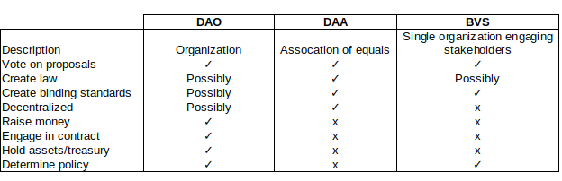

# The Decentralized Autonomous Association (DAA): A New Paradigm for DAOs

This repository introduces the concept of the Decentralized Autonomous Association (DAA), a novel approach to utilizing blockchain governance technology without the legal uncertainties that plague traditional DAOs. The DAA concept focuses on creating standards, principles, and collaborative decision-making rather than engaging in financial or risk-bearing activities.

This is an open concept. Anyone is welcome to implement, modify, or build upon this idea on any blockchain. My purpose is simply to share this idea with the wider developer community in hopes that it inspires new applications of blockchain governance technology that can benefit society at large.

## Original Article

### XXI. The Decentralized Autonomous Association

There are various practical and legal problems with DAOs in their current form. The first issue is that they are not a person in the eyes of the law. The second
issue is that DAOs often perform regulated or risk-bearing activities.

The combination of these two results in the need for participants to protect themselves against liability by "wrapping" the DAO in a legal entity. This removes the 'D' from the equation and turns a DAO into a centralized organization with innovative decentralized governance.

DAOs that wish to remain decentralized risk entering a regulatory minefield. The DAOs concept might be great for managing decentralized networks, but for many other projects they are not suited. Established institutions and their legal teams cannot operate under such uncertain legal conditions. This prevents the wider use of these beneficial technologies.

The solution to this problem is to create a novel kind of DAO, one not engaged in regulated or risk-bearing activities. To achieve this goal, we need a DAO that does not pretend to be an organization. But when we remove the 'O' from the equation, a DAO is no longer a DAO. So, what is it?

**
I suggest replacing the word 'organization' with 'association.' This would make it a DAA.
**

### Definition Decentralized Autonomous Association

Combining the definitions of 'association' from *The Merriam Webster* and *The American Heritage* *Dictionaries* yield the following:

*"A society of persons who have an interest, activity, or purpose in common."*

This definition makes two things clear: a DAA is a collective of multiple separate persons, and it is a society---not an organization.

What does this mean in practice? Each *person* in this society maintains independence while using the DAA solely for specific purposes. The strict independence and absence of shared responsibilities eliminate legal complexity and remove the need for a separate legal entity to wrap this association.

Because it is not an organization, a DAA cannot perform the functions commonly performed by a DAO (or a corporation). It cannot perform regulated activities, such as raising money, and it cannot engage in risk-bearing activities, such as signing contracts, hiring contractors, or owning a treasury or assets.

So, what can it do? A DAA can create law, code, standards, and technologies. It enables societies of any kind to collaborate on creating and voting for binding standards and shared principles. It makes blockchain collaboration tools available to the rest of society. This opens up the possibility to use powerful tools created by the blockchain community for every kind of human cooperation imaginable. As such, the DAA has the following definition:

**
An association of independent persons who have an interest, activity, or purpose in common that uses blockchain technology to collaborate on creating and voting for binding standards and shared principles.
**

### Use-Cases

From a technological point of view, a DAA is not much different from a DAO. It uses the same technology and the same voting mechanisms. Accordingly, one can issue a governance token to vote for proposals. The tokens themselves will be pure utility tokens without monetary value. However, if one wishes to vote in the DAA, one must pay a gas fee for the use of the network. At the time of writing, the only major missing component is the ability to write, discuss, and publish law in a decentralized manner---a relatively simple feature with existing technology.

Once this technology becomes mainstream, one may even see single organizations using it to engage their stakeholders. Many charities, local governments, and NGOs would likely welcome the ability to use DAA tools. They could help them engage stakeholders, create laws and standards, vote on proposals and policies, and record all decisions in a decentralized and transparent manner. Even in the corporate world, DAA tools could help engage staff, record shareholder decisions, or vote for
a new CEO. DAAs can even determine corporate strategy, assigning management a supervisory role.

A private organization using DAA tools is itself not decentralized. It would merely use a Blockchain Voting System (BVS) for internal use. A BVS is an interface for traditional organizations to use blockchain governance technologies to engage their stakeholders. The centralized, low-risk nature of such activities could require a specific kind of smart contract, one where a central party has the authority to assign and reassign voting tokens to staff or stakeholders. One could even think about having a locally run blockchain to ensure privacy.

The difference between the DAO, DAA, and BVS is as follows:

Any blockchain adding this functionality could bring a massive amount of (non-financial) use cases to its ecosystem. The benefits of non-financial use cases extend beyond significant demand for tokens to pay gas fees. They add a level of professionalism and decentralization to a chain that is impossible to ignore. A blockchain that acts as infrastructure for shareholder votes, NGO democracies, and local government law-making has little chance of being scrutinized by judges or regulators. Judges and legislators must consider the consequences of their actions, and they will be reluctant to shut down crucial, widely used infrastructure that people depend on for governance (instead of rampant speculation).

### Example of DAA use

*Bob and Alice are representatives of two major trade organizations. Due to ongoing geopolitical uncertainty, their members face a tremendous increase in legal costs. They wonder if there is a way for them to create industry standards that can help standardize the ongoing contracting work. Alice decides to form a DAA and issue governance tokens for her and Bob. She invites fellow representatives Carol and Dan. Next, Alice proposes the first versions of the legislation on GitHub. Bob and Dan like the idea. Carol points out several potential problems with the current version based on recent industry developments. Bob, Dan, and Carol all agree that these are necessary additions.*

*Alice is not convinced, but a vote done with an internal BVS in her organization demonstrates that her stakeholders overwhelmingly agree with the latest proposal. As such, everyone agrees. The vote is cast, the new standards are approved, and the results are recorded as v1 on the blockchain. The group agrees that any version update requires 75 percent of the vote and limits annual character increases to 10 percent to prevent excess regulation. This process catches the eye of various legislators, who incorporate the standards into a widely recognized binding treaty.*

## Legal Framework for the DAA: Consensus Jurisdiction

If it wants, the Decentralized Autonomous Association concept could operate within a legal framework known as a "Consensus Jurisdiction" (CJ). This provides important context for implementers to understand the legal foundation that makes DAAs viable.

### What is a Consensus Jurisdiction?

A Consensus Jurisdiction is a set of rules that become binding law through participant consent rather than territorial authority. Rather than signing an agreement with a central party, participants sign an agreement with each other, subjecting themselves voluntarily to a self-created legal system.

Technology enables collectives to sign contracts similar to accepting website terms and conditions. This approach allows for the drafting of private international standards, transforming CJs into law for specific groups, technologies, or industries.

### Legal Enforceability

There are two main approaches that make CJs (and by extension, DAAs) legally enforceable:

1. **Pure Consensus Jurisdiction (CJ)**: Everyone participating becomes an automatic party to a governing contract.

2. **Agreement under Decentralized Principles (ADP)**: A CJ or institution enacts guiding principles, which individual parties incorporate and agree to in their private contracts.

### Enforcement Mechanism

For real-world enforceability, a framework already exists: the New York Convention. By adding a simple arbitration clause to an agreement, disputes arising from the CJ can be heard by arbitrators (potentially online) and their rulings would be enforceable in most countries.

### Ideal Applications

The Consensus Jurisdiction framework makes DAAs particularly suitable for:
- Industry-specific collaborations with guiding principles,
- Standardized recurring transactions,
- Governing technological innovation where established law doesn't yet exist,
- Digital areas like smart contracts and blockchain governance,
- International trading, e-commerce, and freelance work,
- Democratizing law-making and standard-setting processes,
- Create a framework for the currently legally toothless "network state."

## Call for Technical Input & Open Research Questions

This concept is offered to the blockchain community as a seed idea that anyone is welcome to develop. No permission is needed – if the DAA concept resonates with you, please feel free to implement it on your chain of choice. You own your implementation fully, and there are no strings attached.

This feature to create law should be a relatively easy add-on for any existing DAO infrastructure. To discuss law one could use the same tools currently used to discuss DAO-proposals.

As a conceptual framework, the DAA needs technical expertise to become reality. Several open questions that implementers might want to consider:

1. What would be the most effective way to create a decentralized system for writing, discussing, and publishing "law" or standards? In the book, the idea is floated of using a wiki to store and amend a body of decentralized law. Alternatively, a special version of Git or perhaps even a simple markup file secured by a smart-contract could do the trick! 
2. How can the governance token system be structured to ensure it remains a pure utility token without financial value?
3. What blockchain platforms would be most suitable for this kind of implementation?
4. How might a layer-two solution for DAAs work on existing chains?
5. What user interfaces would make DAAs accessible to non-technical users?
6. How can smart contracts be designed for the BVS model where a central organization needs to assign/reassign voting tokens?
7. How to create an environment where all paricipants are mutually bound?

Different chains and technical approaches may lead to various implementations, each with unique strengths. This diversity of approaches is welcomed.

## Collaboration & Progress Tracking

If you decide to implement the DAA concept, I'd be genuinely interested to hear about your progress, though there is absolutely no obligation to report back. This repository can serve as a central point for sharing different implementation approaches and tracking the evolution of this idea across the ecosystem.

Feel free to:
- Fork this repository
- Share your implementation in discussions
- Suggest improvements to the concept
- Connect with others working on similar ideas

You can reach me with questions about the concept.

_Note: This repository is meant to inspire and facilitate discussion, not to dictate implementation. The concept is offered freely to the community to develop as they see fit._

---

First Published: April 17, 2025.
